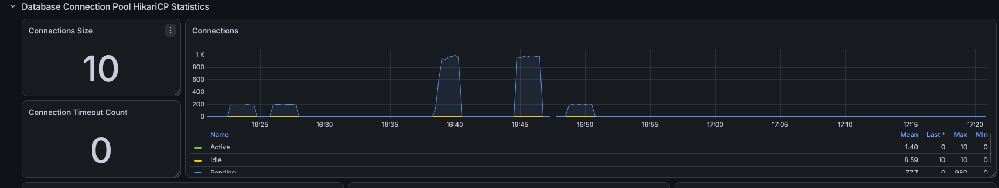
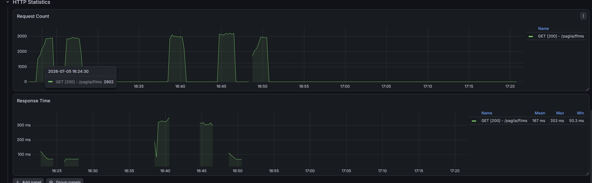
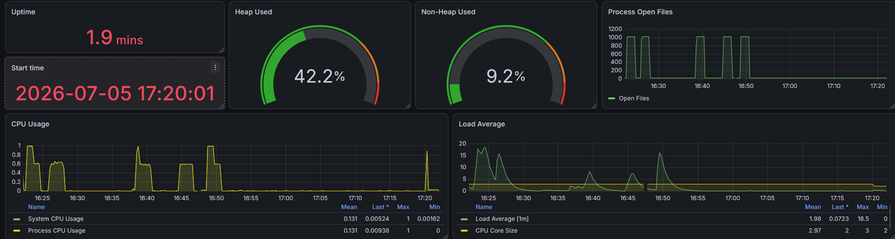
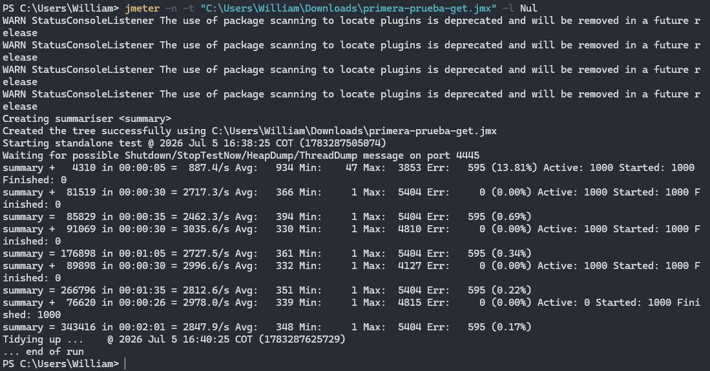

# Tomcat vs WebFlux - CSV performance setup

## Objetivo
Comparar rendimiento entre Tomcat (Spring MVC) y WebFlux con endpoints REST equivalentes, usando los mismos datos en PostgreSQL y metricas con Prometheus/Grafana.

## Requisitos
- Java 25
- Docker Desktop
- Python 3.10+

## Configuracion rapida
1) Levanta PostgreSQL + Prometheus + Grafana + Apps:
```
docker compose up -d
```


## Carga de los datos a PostgreSQL:
- El script carga los esquemas y la data de pagila y descarga el dataset CSV de crímenes

```
python -m venv .venv
```
```
.\.venv\Scripts\Activate
```
```
python -m pip install -r requirements.txt
```
```
python load_data.py   
```
Fuente: https://github.com/devrimgunduz/pagila
Descarga dataset csv: https://data.lacity.org/api/views/2nrs-mtv8/rows.csv?accessType=DOWNLOAD

## Endpoints

Los mismos endpoints están disponibles en ambas implementaciones:

En Tomcat puedes elegir el modo de acceso con `mode=jdbc|jpa` (por defecto `jdbc`):

- **Spring Boot MVC (Tomcat):** `http://localhost:8080`
- **Spring WebFlux (Netty):** `http://localhost:8081`

#### Pagila

| Método | Endpoint | Descripción |
|---------|----------|-------------|
| GET | `/pagila/films` | Listar películas |
| GET | `/pagila/films/{filmId}/actors` | Obtener los actores de una película |
| GET | `/pagila/films/top-rentals` | Obtener el top de películas más rentadas |
| GET | `/pagila/customers/top-payments` | Obtener los clientes con mayor cantidad de pagos |

#### Crime Data

| Método | Endpoint | Descripción |
|---------|----------|-------------|
| GET | `/crimes` | Obtener la lista de crímenes |
| GET | `/crimes/count` | Obtener el conteo de crímenes |


- http://localhost:8080/swagger-ui/index.html
- http://localhost:8081/swagger-ui/index.html

## Imágenes de ejecución
Al endpoint de pagila /films?limit=100&offset=0

<p align="center">
  
  
</p>

<p align="center">
  
  
</p>